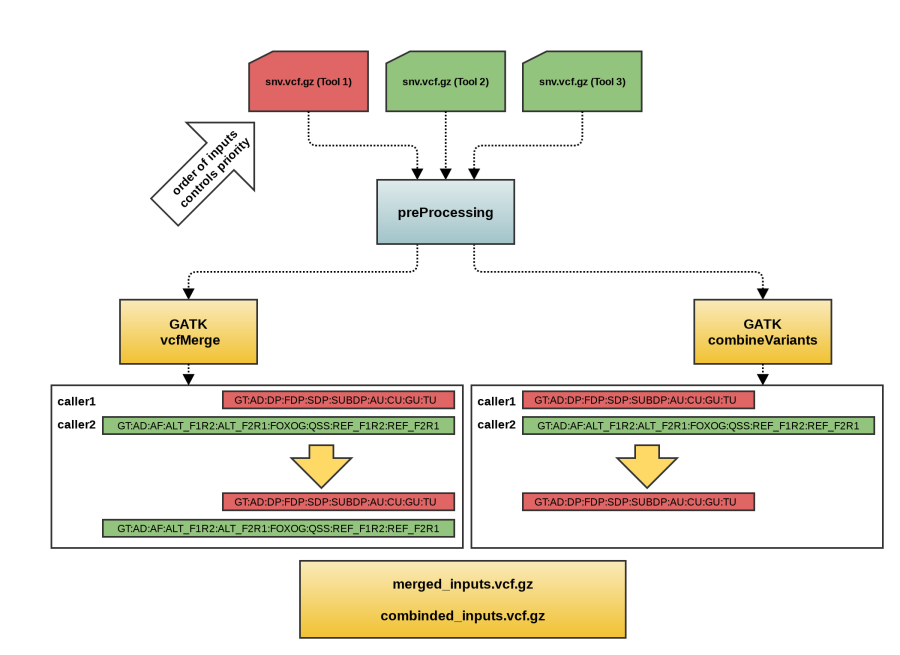

# Variant Merging
VariantMerging 2.0, a workflow for combining variant calls from SNV analyses done with different callers

### Pre-processing

The script used at this step performs the following tasks:

* removes non-canonical contigs
* adds GT and AD fields (dot or calculated based on NT, SGT, if available)
* removes tool-specific header lines

## Overview



## Dependencies

* [java 8](https://github.com/AdoptOpenJDK/openjdk8-upstream-binaries/releases/download/jdk8u222-b10/OpenJDK8U-jdk_x64_linux_8u222b10.tar.gz)
* [tabix 0.2.6](https://sourceforge.net/projects/samtools/files/tabix/tabix-0.2.6.tar.bz2)
* [gatk 4.1.7.0, gatk 3.6.0](https://gatk.broadinstitute.org)


## Usage

### Cromwell
```
java -jar cromwell.jar run variantMerging.wdl --inputs inputs.json
```

### Inputs

#### Required workflow parameters:
Parameter|Value|Description
---|---|---
`inputVcfs`|Array[Pair[File,String]]|Pairs of vcf files (SNV calls from different callers) and metadata string (producer of calls).
`preprocessVcf.referenceId`|String|String that shows the id of the reference assembly
`preprocessVcf.preprocessScript`|String|path to preprocessing script
`preprocessVcf.modules`|String|modules for running preprocessing
`mergeVcfs.modules`|String|modules for this task
`combineVariants.referenceFasta`|String|path to the reference FASTA file
`combineVariants.modules`|String|modules for running preprocessing
`combineVariants.priority`|String|Comma-separated list defining priority of workflows when combining variants


#### Optional workflow parameters:
Parameter|Value|Default|Description
---|---|---|---
`outputFileNamePrefix`|String|""|Output prefix to prefix output file names with.


#### Optional task parameters:
Parameter|Value|Default|Description
---|---|---|---
`preprocessVcf.jobMemory`|Int|12|memory allocated to preprocessing, in gigabytes
`preprocessVcf.timeout`|Int|10|timeout in hours
`mergeVcfs.timeout`|Int|20|timeout in hours
`mergeVcfs.jobMemory`|Int|12|Allocated memory, in GB
`combineVariants.jobMemory`|Int|12|memory allocated to preprocessing, in GB
`combineVariants.timeout`|Int|20|timeout in hours

### Outputs

Output | Type | Description
---|---|---
`mergedVcf`|File|vcf file containing all structural variant calls
`mergedIndex`|File|tabix index of the vcf file containing all structural variant calls
`combinedVcf`|File|filtered vcf file containing all structural variant calls
`combinedIndex`|File|tabix index of the filtered vcf file containing all structural variant calls


## Niassa + Cromwell

This WDL workflow is wrapped in a Niassa workflow (https://github.com/oicr-gsi/pipedev/tree/master/pipedev-niassa-cromwell-workflow) so that it can used with the Niassa metadata tracking system (https://github.com/oicr-gsi/niassa).

* Building
```
mvn clean install
```

* Testing
```
mvn clean verify \
-Djava_opts="-Xmx1g -XX:+UseG1GC -XX:+UseStringDeduplication" \
-DrunTestThreads=2 \
-DskipITs=false \
-DskipRunITs=false \
-DworkingDirectory=/path/to/tmp/ \
-DschedulingHost=niassa_oozie_host \
-DwebserviceUrl=http://niassa-url:8080 \
-DwebserviceUser=niassa_user \
-DwebservicePassword=niassa_user_password \
-Dcromwell-host=http://cromwell-url:8000
```

## Support

For support, please file an issue on the [Github project](https://github.com/oicr-gsi) or send an email to gsi@oicr.on.ca .

_Generated with generate-markdown-readme (https://github.com/oicr-gsi/gsi-wdl-tools/)_
